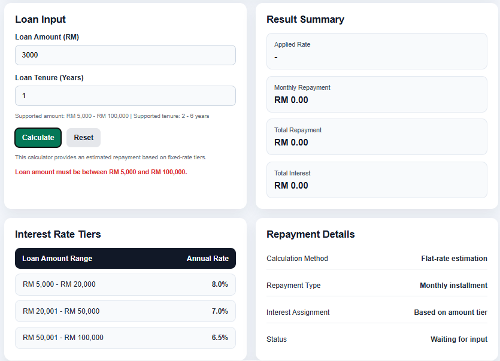

# Maybank-style Personal Loan Calculator

A simple front-end banking loan calculator built with React. This project estimates loan repayment based on fixed interest tiers and flat-rate logic.

## Features

- Calculate monthly repayment
- Calculate total repayment
- Calculate total interest
- Apply interest rate automatically based on loan amount
- Validate loan amount and loan tenure inputs
- Display repayment details in a structured dashboard layout

## Interest Rate Tiers

- RM 5,000 - RM 20,000: 8.0% p.a.
- RM 20,001 - RM 50,000: 7.0% p.a.
- RM 50,001 - RM 100,000: 6.5% p.a.

## Technologies Used

- React
- Vite
- JavaScript
- CSS

## Project Structure

src/  
components/  
data/  
utils/  
assets/styles/

## How to Run

Run `npm install` first, then run `npm run dev`.

## Screenshots

### Home Page

### Sample Calculation 1

### Sample Calculation 2

### Validation Message

## Notes

This calculator is built for learning and portfolio purposes only. It is not an official banking calculator and should not be used for final financial decisions.