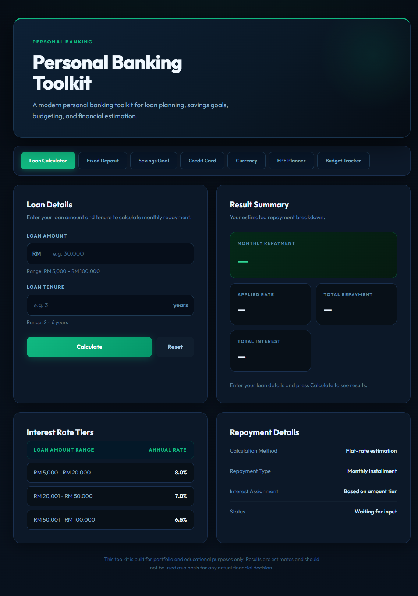
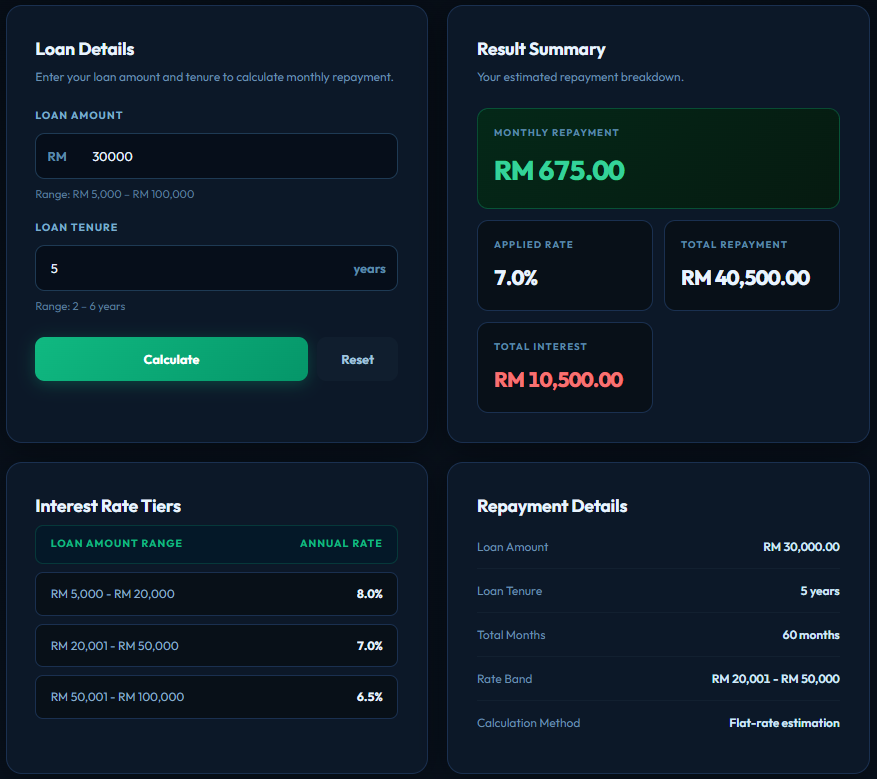
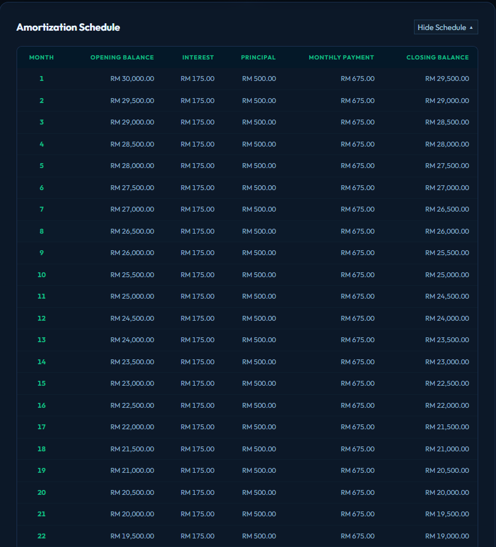
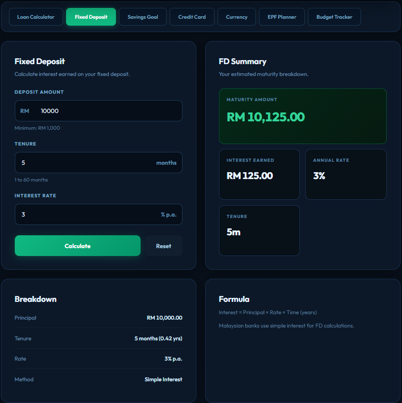
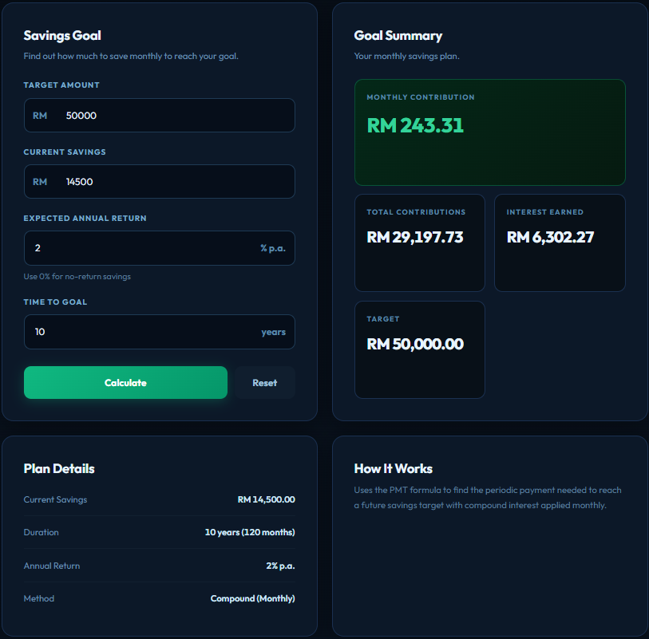
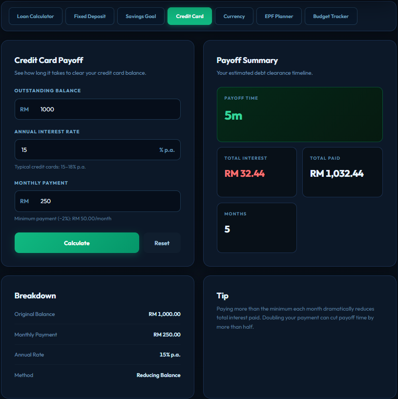
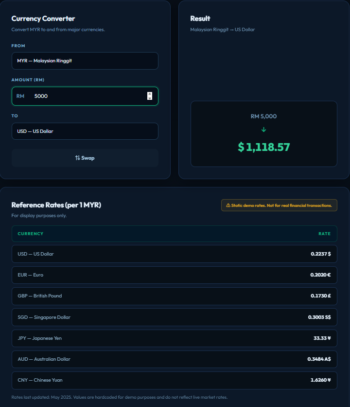
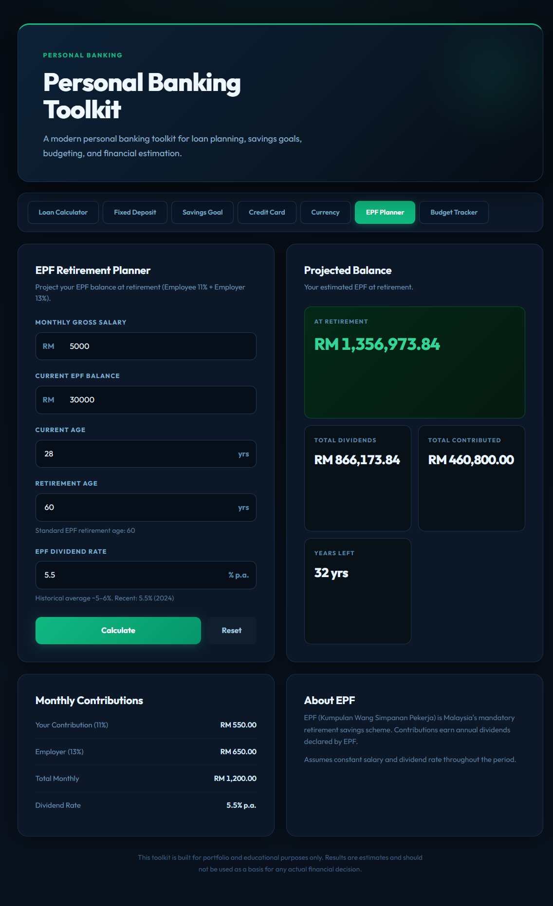
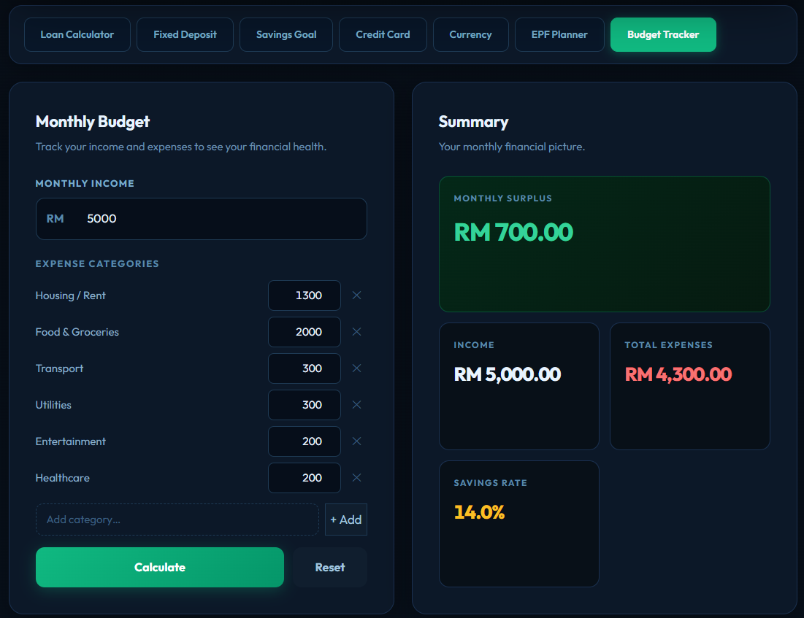
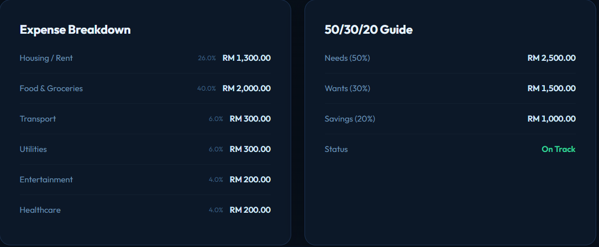

# Personal Banking Toolkit

A modern multi-tool personal finance web app built with React 19 and Vite. Designed with a premium dark banking UI, it brings together seven financial calculators in one clean, tab-based interface — covering everything from loan planning to retirement projection.

> Built for portfolio and educational purposes. Results are estimates only and should not be used for actual financial decisions.

---

## Live Preview



---

## Features

### 1. Loan Calculator
Enter a loan amount and tenure to get a full repayment breakdown. Interest rates are applied automatically based on tiered loan amount ranges.

- Automatic interest tier selection (8.0% / 7.0% / 6.5% p.a.)
- Monthly repayment, total repayment, total interest
- Repayment details panel (rate applied, tenure, total months)
- Full month-by-month amortization schedule table

**Interest Rate Tiers:**

| Loan Amount | Rate |
|---|---|
| RM 5,000 – RM 20,000 | 8.0% p.a. |
| RM 20,001 – RM 50,000 | 7.0% p.a. |
| RM 50,001 – RM 100,000 | 6.5% p.a. |




---

### 2. Fixed Deposit (FD) Calculator
Calculate the returns on a fixed deposit placement.

- Inputs: principal, tenure (months), annual interest rate
- Outputs: interest earned, maturity amount, effective annual yield
- Supports tenures from 1 to 60 months



---

### 3. Savings Goal Calculator
Work backwards from a target amount to find out how much to save monthly.

- Inputs: target amount, current savings, annual return rate (%), years to goal
- Outputs: required monthly contribution, total contributions, total interest earned
- Uses compound interest formula (monthly compounding)



---

### 4. Credit Card Payoff Calculator
Find out how long it will take to pay off a credit card balance.

- Inputs: outstanding balance, annual interest rate, monthly payment
- Outputs: months to payoff, total interest paid, total amount paid
- Shows minimum payment warning (2% of balance or RM 50, whichever is higher)
- Detects and warns if the monthly payment is too low to ever pay off the balance



---

### 5. Currency Converter
Convert MYR to and from 7 major currencies with a live reference rate table.

- Bidirectional conversion (any currency to any currency, via MYR)
- Swap button to instantly reverse the conversion direction
- Reference rate table showing all rates per 1 MYR
- Currencies supported: USD, EUR, GBP, SGD, JPY, AUD, CNY

> Rates are static demo values (as of May 2025) and do not reflect live market data.



---

### 6. EPF Retirement Planner
Project your EPF (Employees Provident Fund) balance at retirement age.

- Inputs: monthly salary, current EPF balance, current age, retirement age
- Uses Malaysian EPF contribution rates: Employee 11% + Employer 13% = 24% total
- Assumes 5.5% annual dividend rate (adjustable in logic)
- Outputs: monthly contribution breakdown, projected balance, total contributions, total dividends earned



---

### 7. Budget Tracker
Track monthly income and expenses to see your financial health at a glance.

- Input monthly income and up to any number of expense categories
- 6 default categories: Housing/Rent, Food & Groceries, Transport, Utilities, Entertainment, Healthcare
- Add and remove custom expense categories
- Live surplus / deficit indicator with colour coding (green = surplus, red = deficit)
- Savings rate calculation with status indicator (≥20% green, ≥10% yellow, <10% red)
- Expense breakdown panel showing each category's amount and % of income
- 50/30/20 budgeting guide panel (Needs / Wants / Savings targets)




---

## Tech Stack

| Area | Technology |
|---|---|
| UI Framework | React 19 |
| Build Tool | Vite 8 |
| Language | JavaScript (ES2022+) |
| Styling | Plain CSS (no UI framework) |
| Font | Outfit (Google Fonts) |
| Routing | None — pure state-based tab switching |
| Package Manager | npm |

### Key implementation techniques

- **Component architecture** — each feature is a self-contained folder under `src/components/` with its own JSX and logic
- **Pure utility functions** — all financial math lives in `src/utils/` as stateless pure functions with no side effects
- **Flat-rate loan math** — `calculateLoan.js` uses flat-rate (not reducing balance) interest: `totalInterest = principal × rate × years`
- **Compound interest** — Savings Goal and EPF use standard future-value compound interest formulas (`FV = PV × (1+r)^n`)
- **Amortization schedule** — `calculateAmortization.js` generates a row-per-month table of opening balance, interest portion, principal portion, and closing balance
- **Credit card payoff simulation** — iterative month-by-month loop (capped at 600 months) to handle non-linear reducing balance
- **Tiered rate lookup** — `loanRates.js` stores rate tiers as an array; `getRateByAmount()` does a range find
- **Bidirectional currency conversion** — all conversions route through MYR as a base currency, eliminating the need for a full cross-rate matrix
- **Dynamic category management** — Budget Tracker uses React state to add/remove expense categories at runtime
- **CSS custom theming** — dark premium banking theme using CSS variables and design tokens; no Tailwind or styled-components
- **Tabular numerics** — `font-variant-numeric: tabular-nums` applied to all financial output values for clean column alignment
- **Responsive layout** — CSS Grid with a single `@media (max-width: 860px)` breakpoint collapses all two-column grids to single column

---

## Project Structure

```
personal-banking-toolkit/
├── public/
│   └── screenshots/          
├── src/
│   ├── components/
│   │   ├── Header.jsx
│   │   ├── TabNav.jsx
│   │   ├── FooterNote.jsx
│   │   ├── LoanForm.jsx
│   │   ├── ResultSummary.jsx
│   │   ├── RateTable.jsx
│   │   ├── RepaymentDetails.jsx
│   │   ├── AmortizationTable.jsx
│   │   ├── FixedDeposit/
│   │   │   └── FDForm.jsx
│   │   ├── SavingsGoal/
│   │   │   └── SavingsGoalForm.jsx
│   │   ├── CreditCard/
│   │   │   └── CreditCardForm.jsx
│   │   ├── CurrencyConverter/
│   │   │   └── CurrencyConverter.jsx
│   │   ├── EPF/
│   │   │   └── EPFForm.jsx
│   │   └── BudgetTracker/
│   │       └── BudgetTracker.jsx
│   ├── data/
│   │   ├── loanRates.js
│   │   └── exchangeRates.js
│   ├── utils/
│   │   ├── calculateLoan.js
│   │   ├── calculateAmortization.js
│   │   ├── calculateFD.js
│   │   ├── calculateSavingsGoal.js
│   │   ├── calculateCreditCard.js
│   │   ├── calculateEPF.js
│   │   ├── formatCurrency.js
│   │   └── validateInputs.js
│   ├── assets/styles/
│   │   ├── global.css
│   │   ├── layout.css
│   │   └── components.css
│   ├── App.jsx
│   └── main.jsx
├── index.html
├── package.json
└── vite.config.js
```

---

## Getting Started

```bash
# Install dependencies
npm install

# Start development server
npm run dev

# Build for production
npm run build

# Preview production build
npm run preview
```

---


## Notes

- This app is built for educational purposes only.
- All calculations are estimates. Credit card and EPF calculations use simplified assumptions.
- Currency exchange rates are hardcoded static values (May 2025) and do not reflect live market data.
- EPF contribution rates are based on Malaysian statutory rates (Employee 11%, Employer 13%).
