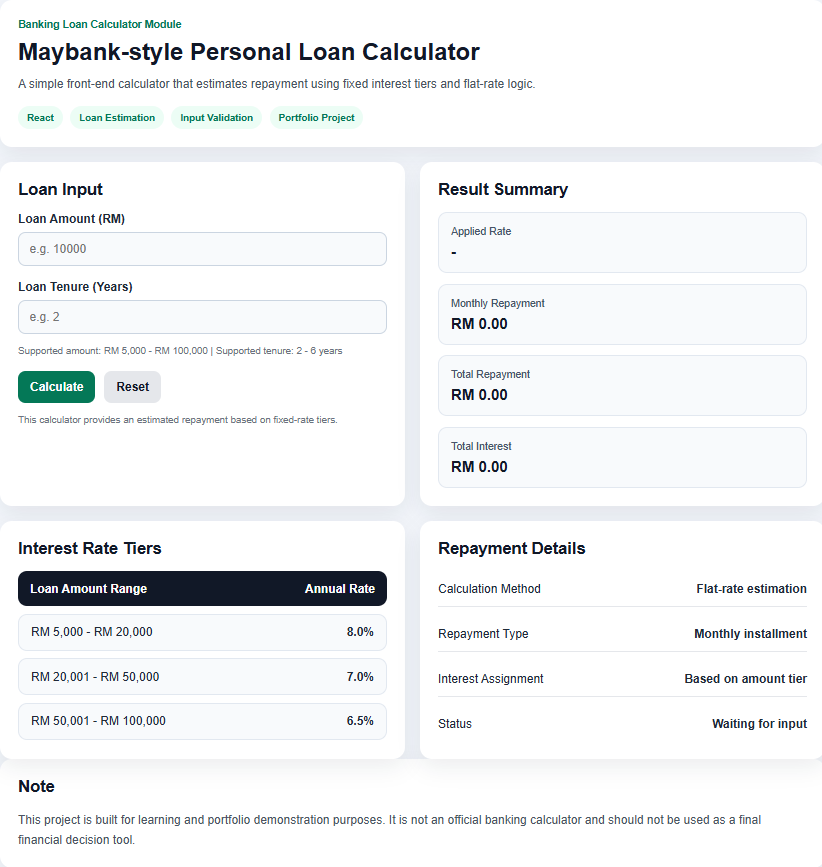
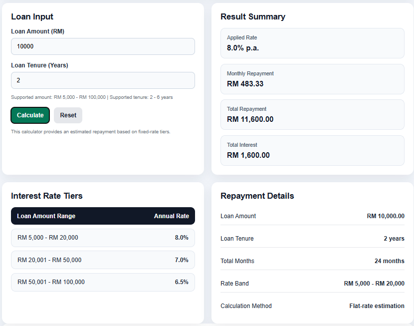
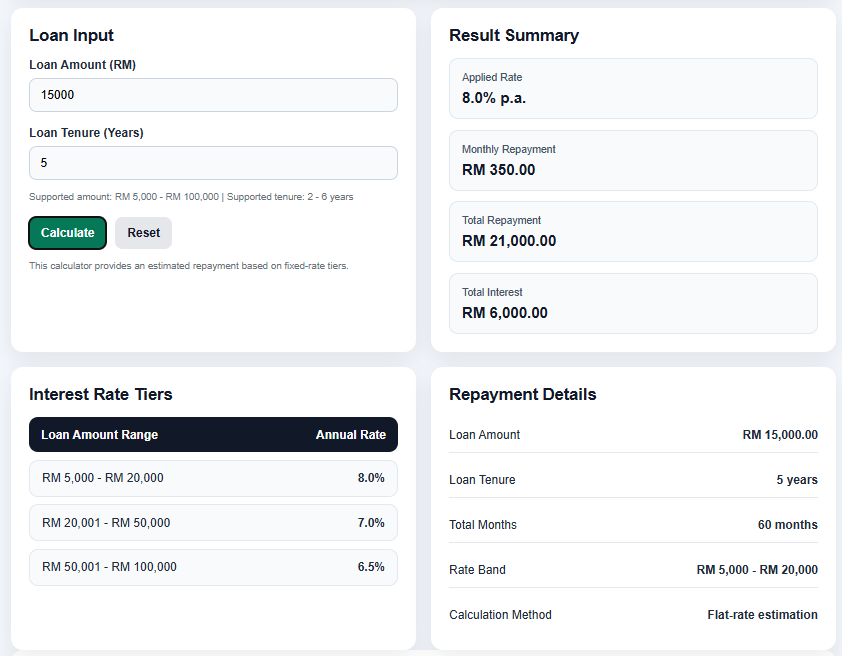

# Personal Banking Toolkit

A modern personal banking toolkit built with React and Vite. Includes multiple financial tools for loan planning, savings goals, budgeting, and financial estimation.

## Features

- **Loan Calculator** — Monthly repayment, total repayment, and total interest with automatic interest tier selection and amortization schedule
- **Fixed Deposit** — Interest earned, maturity amount, and effective annual yield
- **Savings Goal** — Monthly contribution needed to reach a target with a given return rate
- **Credit Card Payoff** — Months to pay off, total interest, and total paid
- **Currency Converter** — MYR to/from major currencies (USD, EUR, GBP, SGD, JPY, AUD)
- **EPF Planner** — Projected EPF balance at retirement using employee/employer contributions
- **Budget Tracker** — Track monthly income and expenses with a live surplus/deficit summary

## Technologies Used

- React 19
- Vite
- JavaScript
- CSS (plain vanilla, no UI frameworks)

## Project Structure

```
src/
  components/
  data/
  utils/
  assets/styles/
```

## How to Run

```bash
npm install
npm run dev
```

## Screenshots

### Home Page



### Sample Calculation 1



### Sample Calculation 2



### Validation Message


## Notes

This toolkit is built for portfolio and educational purposes only. Results are estimates and should not be used as a basis for any actual financial decision.
